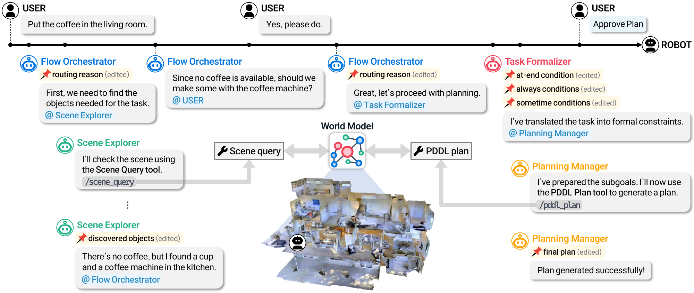
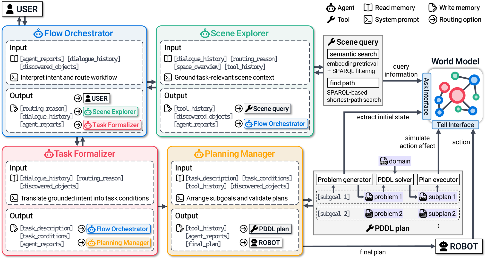
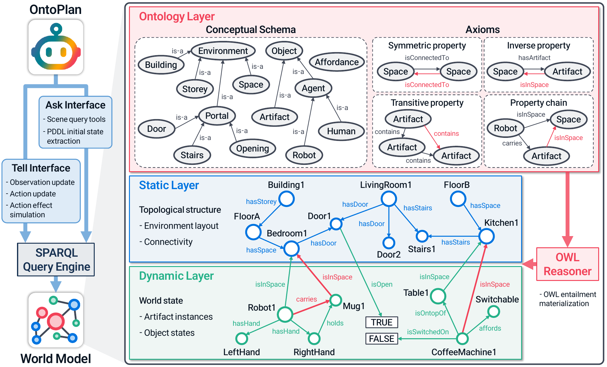
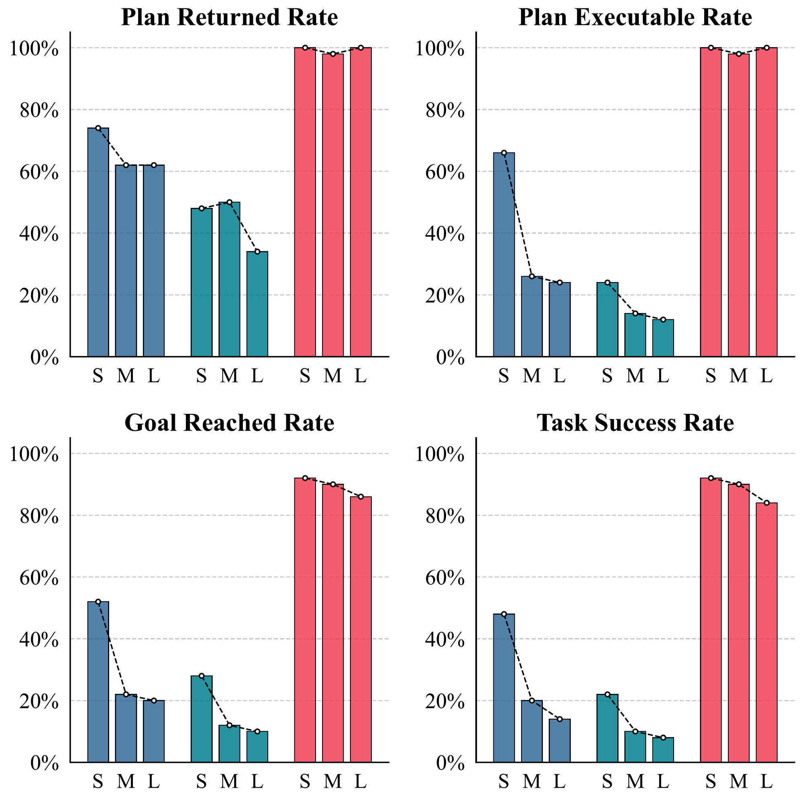
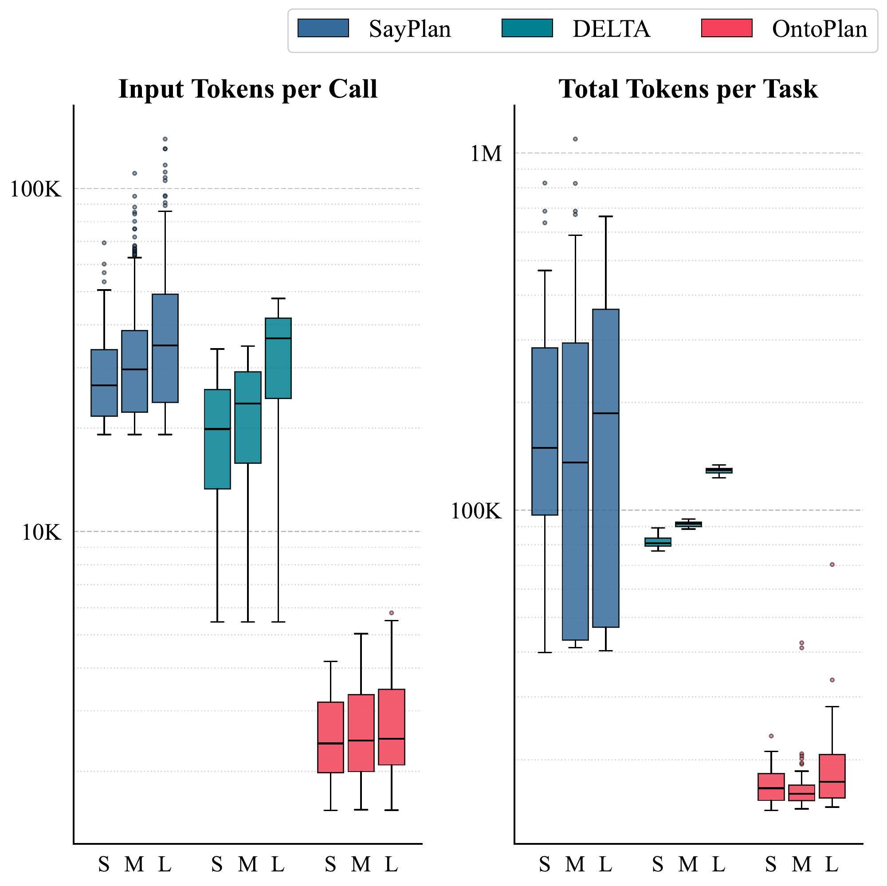
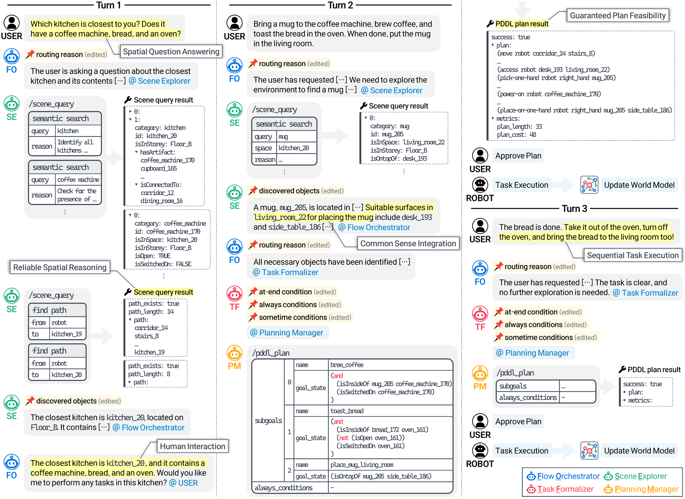

<div align="center">

<h1>OntoPlan: An Ontology-Grounded Scene Representation<br>and Agentic Framework for Scalable Robot Task Planning</h1>

<p>
  <b>NeurIPS 2026</b>
</p>

<p>
  Hyeongwoo Nam, Woongje Cho<sup>*</sup>, Juwon Kim<sup>*</sup>, Jongeun Choi<sup>†</sup><br>
  <sub>School of Mechanical Engineering, Yonsei University &nbsp;·&nbsp; <sup>*</sup>Equal contribution &nbsp;·&nbsp; <sup>†</sup>Corresponding author</sub>
</p>

<p>
  <a href="https://namhyeongwoo.github.io/OntoPlan/"><b>Project Page</b></a>
  &nbsp;|&nbsp;
  <a href="https://openreview.net/forum?id=7YcnWpfSWA"><b>Paper</b></a>
  &nbsp;|&nbsp;
  <a href="https://arxiv.org/abs/2610.07649"><b>arXiv</b></a>
  &nbsp;|&nbsp;
  <a href="INSTALL.md"><b>Installation</b></a>
</p>

<p>
  
  <a href="LICENSE"></a>
</p>

</div>

<p align="center">
  
  <br>
  <sub>From a user instruction, the Flow Orchestrator routes grounding, clarification, task formalization, and planning across specialized agents, while the Scene query and PDDL plan tools operate over a shared ontology-grounded world model.</sub>
</p>

## Overview

**OntoPlan** is an agentic framework for long-horizon robot task planning in large indoor environments. LLM agents interpret instructions, ask for clarification, and formalize goals and constraints; structured tools handle selective scene access and executable planning.

1. **Ontology-grounded world model.** Scene grounding, task formalization, and planning share one symbolic vocabulary: ontology classes and properties map one-to-one to PDDL types and predicates, so no schema translation is needed between them.
2. **Tool-using agent workflow.** Four role-specialized agents coordinate over shared memory. The *Scene query* tool retrieves only task-relevant objects, spaces, and relations via SPARQL; the *PDDL plan* tool extracts the current state and solves ordered subgoals with Fast Downward.

### Key results

150 general tasks across five indoor environments and three scene scales (GPT-4o, temperature 0):

| Method | Task Success ↑ | Total Tokens per Task (×10³) ↓ |
|---|:---:|:---:|
| SayPlan | 0.27 | 216.0 |
| DELTA | 0.13 | 100.6 |
| **OntoPlan** | **0.89** | **18.1** |

- About 5.6× fewer tokens than the most efficient baseline.
- Token cost stays flat from Small to Large scenes (1.15× growth while object counts grow 10–23×).
- Asks for clarification on ambiguous or infeasible instructions instead of committing to invalid plans (9/10 infeasible requests).

## Installation

Requirements: Linux or macOS (Windows via WSL), Python 3.11, Docker (for GraphDB), a C++20 compiler and CMake (for Fast Downward), and an OpenAI API key. See **[INSTALL.md](INSTALL.md)** for details and troubleshooting.

```bash
git clone --recursive https://github.com/namhyeongwoo/OntoPlan.git
cd OntoPlan

conda create -n ontoplan python=3.11 -y && conda activate ontoplan
pip install -e .

# Fast Downward (git submodule)
cd pddl/fast-downward && ./build.py && cd ../..

# GraphDB; the OntoPlan repository is created on first run
docker run -d --name graphdb -p 7200:7200 ontotext/graphdb:10.7.0

cp .env.example .env   # then set OPENAI_API_KEY
```

## Try it

**LangGraph Studio** (chat with the agents and inspect every node and tool call). Run `langgraph dev`, then start a thread with the input `{"env_id": "Klickitat", "env_size": "small"}` and type instructions in the chat.

**Terminal.** Runs a session and prints the agent trace:

```bash
python -m agent.cli --env Klickitat --size small                       # interactive
python -m agent.cli --env Klickitat --size small "Move the vase in the living room on Floor B to the bathroom on Floor C. Use only your right hand for this task."
```

Environments: `Klickitat`, `Lakeville`, `Lindenwood`, `Marstons`, `Muleshoe`, each at `small`, `medium`, or `large` scale. The first session for an environment embeds its category names (a few seconds of OpenAI embedding calls) and caches the index under `world_model/data/envs/<env>/<size>/vector_store/`.

Example (abridged output of the command above):

```text
User: Move the vase in the living room on Floor B to the bathroom on Floor C. Use only your right hand for this task.
  [Flow Orchestrator] -> scene_explorer: ... explore the environment to identify these objects ...
  [Scene Explorer] Found:
      - Source object: `vase_80` (vase) in `living_room_22`
      - Destination: `bathroom_3` (bathroom) on `Floor_C`
  [Flow Orchestrator] -> task_formalizer: ... The task requires using only the right hand ...
  [Task Formalizer] at_end: (isOnFloorOf vase_80 bathroom_3)
  [Task Formalizer] always: (isEmpty left_hand)
  [Planning Manager] All subgoals succeeded - auto-approved
Robot: Done. 1/1 subgoals succeeded.
  [OK] Move the vase to the bathroom on Floor C (21 actions)
    (move robot corridor_12 stairs_2)
    (move robot stairs_2 living_room_22)
    (access robot vase_80 living_room_22)
    (pick-one-hand robot right_hand vase_80)
    ...
    (open-door robot door_8)
    (move robot door_8 bathroom_3)
    (place-to-location-one-hand robot right_hand vase_80 bathroom_3)
  (7 LLM calls, 21,078 tokens, 14s)
```

Instructions in one session share the world state: each approved plan is applied to the world model, and the next instruction starts from the result.

## How it works

<p align="center">
  
</p>

| Agent | Role |
|---|---|
| **Flow Orchestrator** | Interprets the instruction and dialogue; routes to clarification, scene grounding, or task formalization |
| **Scene Explorer** | Queries the world model for task-relevant objects, spaces, relations, and states |
| **Task Formalizer** | Writes planner-facing `at_end` goals and `always` / `sometime` trajectory constraints |
| **Planning Manager** | Orders subgoals, calls the PDDL plan tool, and replans on failure |

<p align="center">
  
  <br>
  <sub>Three-layer world model (ontology / static / dynamic) with an ask/tell interface. GraphDB materializes OWL 2 RL entailments on every update.</sub>
</p>

## Benchmark

Five indoor environments from the [3D Scene Graph dataset](https://3dscenegraph.stanford.edu/), mapped into the OntoPlan ontology (Small), manually augmented (Medium), and augmented to three times the Medium object count (Large). All scales share the same ontology and PDDL domain.

| Environment | Floors | Rooms | Small | Medium | Large |
|---|:---:|:---:|---:|---:|---:|
| Klickitat   | 3 | 28 | 84  | 385 | 1,155 |
| Lakeville   | 2 | 19 | 83  | 387 | 1,161 |
| Lindenwood  | 2 | 36 | 59  | 318 | 954   |
| Marstons    | 4 | 31 | 50  | 388 | 1,164 |
| Muleshoe    | 2 | 24 | 121 | 423 | 1,269 |

The last three columns are object counts.

The benchmark in `benchmark/` has 150 general tasks (10 per environment and scale), each with the `at_end`, `always`, and `sometime` conditions used for scoring (and, for six tasks, `ordering`) (see [benchmark/README.md](benchmark/README.md)).

## Results

<p align="center">
  
  
</p>

OntoPlan keeps the highest rate on every metric at every scale, and its token cost stays flat as scenes grow. See the paper for per-environment results, ablations, and the ambiguous and infeasible subsets.

<p align="center">
  
  <br>
  <sub>A multi-turn session: spatial question answering, commonsense grounding, executable planning, and follow-up planning after world-model updates.</sub>
</p>

## Reproducing the paper

`experiments/` runs OntoPlan and its ablations on the benchmark and scores the returned plans with the same symbolic evaluator used in the paper:

```bash
python -m experiments.run --name my-run       # one fresh session per task
python -m experiments.report --name my-run    # tables as in the paper
```

See [experiments/README.md](experiments/README.md) for the ablations.

## Repository structure

```text
agent/                  LangGraph workflow
  nodes/                Flow Orchestrator, Scene Explorer, Task Formalizer, Planning Manager, USER, ROBOT
  tools/                scene_query (semantic_search, find_path) and pddl_plan tools
  utils/                action effects on the world model; always-condition compilation
  prompts.py            agent system prompts (paper Appendix B)
  cli.py                terminal interface
world_model/
  core/                 GraphDB client, configuration, category embedding index
  tools/                SPARQL query functions behind the scene_query tool
  data/schema.ttl       ontology (OWL)
  data/envs/            five environments x three scales (static.ttl, dynamic.ttl)
pddl/
  domain.pddl           PDDL domain aligned with the ontology
  scripts/              problem generation from the world model
  fast-downward/        Fast Downward planner (git submodule)
benchmark/              150 evaluation tasks with their scoring conditions
experiments/            benchmark runner, evaluator, ablations, reports
docs/                   project page
```

## Citation

```bibtex
@inproceedings{nam2026ontoplan,
  title     = {{OntoPlan}: An Ontology-Grounded Scene Representation and Agentic Framework for Scalable Robot Task Planning},
  author    = {Nam, Hyeongwoo and Cho, Woongje and Kim, Juwon and Choi, Jongeun},
  booktitle = {Advances in Neural Information Processing Systems},
  year      = {2026}
}
```

## License

- **Code** is released under the [MIT License](LICENSE).
- **Environment data** in `world_model/data/envs/` is derived from the [3D Scene Graph dataset](https://3dscenegraph.stanford.edu/) (Armeni et al., ICCV 2019) and is subject to its terms of use, which permit non-commercial research use only. See [world_model/data/README.md](world_model/data/README.md).
- **Fast Downward** is included as a git submodule and is licensed under GPLv3.
